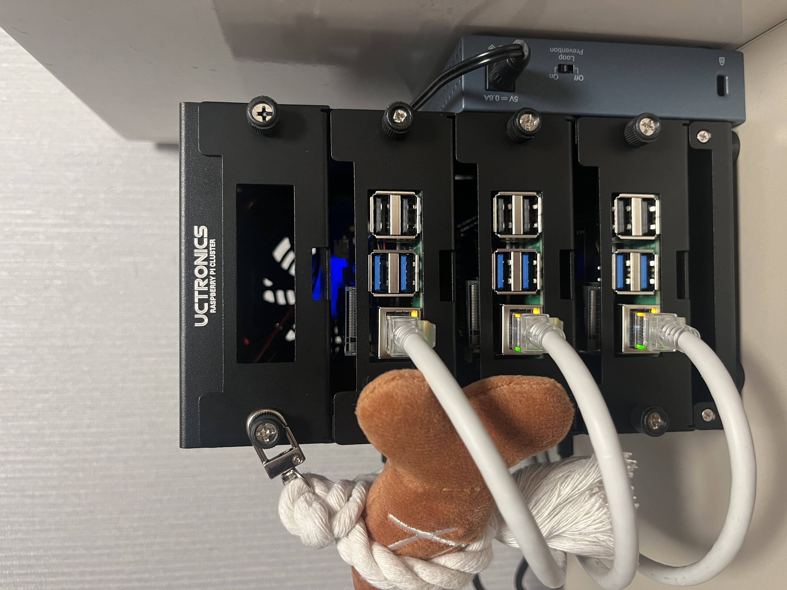

# multi-tenant-server project
A Kubernetes-based multi-tenant server hosting project running on a Raspberry Pi Homelab cluster.

## 1. Project Overview
- 라즈베리파이 쿠버네티스 기반의 멀티 테넌트 SSH 서버 제공 프로젝트
- 핵심 목표: 제한된 리소스 내에서 다수의 사용자에게 독립된 개발 환경을 안전하게 제공

## 2. Infrastructure & Stack
- OS: Debian GNU/Linux 12 (bookworm, for Master/Worker Nodes)
- Orchestration: Kubernetes v1.31.14
- Container Runtime: containerd v1.6.20
- Networking: Cilium v1.18.5 & MetalLB v0.14.x (L2 Mode)

## 3. Server Specs (Per Tenant)
### Model: `tenant-basic`
- CPU: 1.0vCPU, 0.1 Core (Request) / 1.0 Core (Limit)
- Memory: 512MiB (Request) / 1GiB (Limit)
- Storage: 8GiB Persistent Volume
- OS: Alpine Linux (OpenSSH Server)
    - 리소스 절약을 위해 Alpine Linux를 채택했습니다.
    - 패키지 매니저: Ubuntu의 `apt` 대신 `apk`를 사용하며, **설치 전 업데이트가 필수입니다.**
    - 명령어 예시: 
        - `sudo apk update` (패키지 목록 업데이트 - *필수*)
        - `sudo apk add [패키지명]` (패키지 설치)
        - `sudo apk del [패키지명]` (패키지 삭제)

> **Tip**: 기본 쉘이 익숙하지 않다면 `sudo apk add bash` 설치 후 `bash`를 입력하여 전환할 수 있습니다.

### Model: `tenant-standard`
- CPU: 1.5vCPU, 0.5 Core (Request) / 1.5 Core (Limit)
- Memory: 1MiB (Request) / 2GiB (Limit)
- Storage: 16GiB Persistent Volume
- OS: TBD

### Model: `tenant-pro`
- CPU: 2.0vCPU, 1.0 Core (Request) / 2.0 Core (Limit)
- Memory: 2MiB (Request) / 4GiB (Limit)
- Storage: 32GiB Persistent Volume
- OS: TBD

## Use Cases
